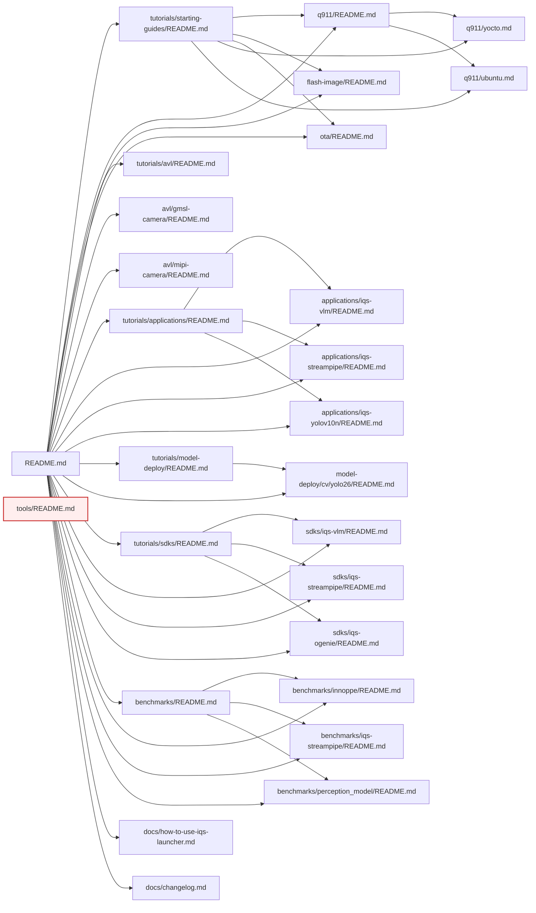

# iQ-Studio Documentation Inventory

Read-only link-graph discovery. Source of truth: [README.md](../README.md) as the entry point; all `.md` files reachable by following its outbound links recursively. Code/build artifacts (`mod/`, `binaries/`, `*.py`, `*.sh`, `*.json`, `LICENSE`, scripts under `benchmarks/**/scripts/`) are excluded from the documentation graph but referenced where relevant.

## 1. Executive Summary

- **27 in-scope `.md` files total**; **26 reachable** from [README.md](../README.md) via the link graph. **1 orphan**: [tools/README.md](../tools/README.md).
- **Link graph is shallow and tidy**: README is the central hub; every section has its own `README.md` index that links its children. Mean depth from root is 2; max depth is 3 ([benchmarks/iqs-streampipe/README.md](../benchmarks/iqs-streampipe/README.md) → [tutorials/applications/iqs-streampipe/README.md](../tutorials/applications/iqs-streampipe/README.md) → [tutorials/sdks/iqs-streampipe/README.md](../tutorials/sdks/iqs-streampipe/README.md)).
- **2 broken links** (P0):
  - [tutorials/starting-guides/ota/README.md](../tutorials/starting-guides/ota/README.md) references `../../../IQS.md` → resolves to `/iQ-Studio/IQS.md` which does not exist. (Real file is at `.agents/IQS.md`, out of scope and not user-facing.)
  - [tutorials/model-deploy/cv/yolo26/README.md](../tutorials/model-deploy/cv/yolo26/README.md) references `../../../starting-guides/q911/README.md#interact-with-the-system-using-adb-over-usb-type-c` — the file exists but the anchor does not. That subsection lives in [q911/yocto.md](../tutorials/starting-guides/q911/yocto.md), not in [q911/README.md](../tutorials/starting-guides/q911/README.md).
- **`tutorials/metadata.json` is not a tutorial-ordering manifest** — it is an `iqs-launcher` autotag → `run.sh` map for 4 application demos. The brief's framing of it as "authoritative tutorial ordering / categorization" is incorrect; there is no separate metadata document declaring docs IA. README is the only source.
- **Biggest IA issue**: [tutorials/avl/README.md](../tutorials/avl/README.md) does NOT link to its children [gmsl-camera/README.md](../tutorials/avl/gmsl-camera/README.md) and [mipi-camera/README.md](../tutorials/avl/mipi-camera/README.md). They are only reachable from root README. A reader landing on the AVL section page cannot navigate further from there.
- **3 reverse-direction orphans inside-the-graph** — section hub pages that lack child links: [tutorials/avl/README.md](../tutorials/avl/README.md) (described above), [tutorials/applications/iqs-yolov10n/README.md](../tutorials/applications/iqs-yolov10n/README.md) (leaf with no SDK customization handoff), and [tutorials/applications/README.md](../tutorials/applications/README.md) (does not list the model-deploy YOLO26 doc as a related path).
- **3 stub pages** (P2; < 30 lines): [tutorials/avl/gmsl-camera/README.md](../tutorials/avl/gmsl-camera/README.md) (10 lines), [tutorials/avl/mipi-camera/README.md](../tutorials/avl/mipi-camera/README.md) (11 lines), [tutorials/starting-guides/README.md](../tutorials/starting-guides/README.md) (17 lines), [tutorials/applications/README.md](../tutorials/applications/README.md) (19 lines), [tutorials/sdks/README.md](../tutorials/sdks/README.md) (19 lines), [tutorials/avl/README.md](../tutorials/avl/README.md) (19 lines), [benchmarks/README.md](../benchmarks/README.md) (20 lines).
- **Missing common pages**: no quickstart page distinct from README (Quick Start is a README section), no troubleshooting hub (one-off section exists at end of [docs/how-to-use-iqs-launcher.md](../docs/how-to-use-iqs-launcher.md)), no glossary, no FAQ.
- **Media that will not render natively on GitHub Pages**: 1 mp4 ([benchmarks/iqs-streampipe/fig/nv_qc_live.mp4](../benchmarks/iqs-streampipe/fig/nv_qc_live.mp4)), 1 mp4 in repo but unreferenced from any md ([tutorials/applications/iqs-vlm/fig/Open WebUI demo.mp4](../tutorials/applications/iqs-vlm/fig/Open%20WebUI%20demo.mp4)), plus 1 GitHub user-attachments video embedded by URL in [tutorials/sdks/iqs-vlm/README.md](../tutorials/sdks/iqs-vlm/README.md) — that URL works on GitHub.com but will not render on GitHub Pages. 9 GIFs spread across applications, sdks, and model-deploy.
- **Top recommendation**: split [README.md](../README.md) into a marketing-style landing page (the "Pick Your Path" + "30-Second Demo" funnel + Quick Start) and a separate Overview/IA doc that owns the long "Explore Documentation & Resources" table. Keep the table out of the homepage; the site nav should carry that information. Also fix the AVL section README to link to its children before launch.

## 2. Document Graph (top 2 levels)



Cross-links between sections (not shown above to keep the diagram readable): app demos link to their SDK companions; SDK pages link back to their applications; AVL stubs link to [iqs-streampipe](../tutorials/applications/iqs-streampipe/README.md); benchmarks link to applications and starting-guides; q911 README links to applications, sdks, avl, benchmarks (as "Next Steps"); model-deploy yolo26 links to q911 ADB anchor.

## 3. Full File Inventory

| Path | Title | Type | Lines | Words | Inbound | Outbound `.md` | Role | Assets |
|---|---|---|---|---|---|---|---|---|
| [README.md](../README.md) | iQ Studio | overview | 220 | 1061 | 0 | 23 | root | 5 png (incl. logo, stack, roadmap), 1 gif (vlm-demo) |
| [docs/how-to-use-iqs-launcher.md](../docs/how-to-use-iqs-launcher.md) | How to Use iqs-launcher | how-to | 183 | 850 | 1 (README) | 3 (README anchor, apps, sdks) + `../mod/` non-md | leaf+ | 2 svg flow diagrams, 1 png |
| [docs/changelog.md](../docs/changelog.md) | Changelogs | changelog | 79 | 383 | 1 (README) | 0 | leaf | none |
| [tools/README.md](../tools/README.md) | iQ-Studio Contributor Tools | reference | 89 | 458 | 0 (in-scope) | 1 non-scope (`.agents/skills/.../SKILL.md`) | **orphan** | none in-doc |
| [benchmarks/README.md](../benchmarks/README.md) | Benchmarks | hub | 20 | 108 | 1 (README) | 5 (3 children + starting-guides + applications) | hub | none |
| [benchmarks/innoppe/README.md](../benchmarks/innoppe/README.md) | InnoPPE Benchmark between Jetson AGX and Qualcomm QCS9075 | benchmark-report | 126 | 541 | 2 (README, benchmarks hub) | 0 | leaf | 1 png, 1 svg, 1 png (cpu chart) |
| [benchmarks/iqs-streampipe/README.md](../benchmarks/iqs-streampipe/README.md) | Multi-stream inference status on Jetson AGX and Qualcomm QCS9075 | benchmark-report | 165 | 990 | 2 (README, benchmarks hub) | 1 (applications/iqs-streampipe) | leaf | 3 png charts, 2 png outputs, **1 mp4** |
| [benchmarks/perception_model/README.md](../benchmarks/perception_model/README.md) | Perception AI benchmark between QCS9075-EVK and NVIDIA AGX Orin | benchmark-report | 93 | 566 | 2 (README, benchmarks hub) | 0 | leaf | 1 png |
| [tutorials/starting-guides/README.md](../tutorials/starting-guides/README.md) | Starting Guides | hub | 17 | 110 | 3 (README, benchmarks, launcher) | 5 (q911, q911 yocto/ubuntu, flash-image, ota, applications, avl) | hub | none |
| [tutorials/starting-guides/q911/README.md](../tutorials/starting-guides/q911/README.md) | Q911 Platform Quick Start Guide | tutorial | 145 | 692 | 2 (README, starting-guides) | 6 (yocto, ubuntu, flash-image, apps, sdks, avl, benchmarks) | hub | 9 png via `` tags |
| [tutorials/starting-guides/q911/yocto.md](../tutorials/starting-guides/q911/yocto.md) | Q911 — Yocto Linux Interaction Guide | tutorial | 150 | 558 | 2 (starting-guides, q911) | 1 (q911 anchors) | leaf | 12 png |
| [tutorials/starting-guides/q911/ubuntu.md](../tutorials/starting-guides/q911/ubuntu.md) | Q911 — Ubuntu Interaction Guide | tutorial | 116 | 518 | 2 (starting-guides, q911) | 2 (flash-image, q911 anchors) | leaf | 8 png |
| [tutorials/starting-guides/flash-image/README.md](../tutorials/starting-guides/flash-image/README.md) | Q911 Image Flashing Guide | tutorial | 128 | 577 | 3 (README, starting-guides, q911 ubuntu) | 1 (q911 anchor) | leaf | 10 png (some via `../q911/fig`) |
| [tutorials/starting-guides/ota/README.md](../tutorials/starting-guides/ota/README.md) | Qualcomm OTA Guide | tutorial | 53 | 323 | 2 (README, starting-guides) | 1 broken (`../../../IQS.md`) | leaf | 2 png |
| [tutorials/avl/README.md](../tutorials/avl/README.md) | Approved Vendor List | overview | 19 | 85 | 2 (README, q911) | **0 children** | hub-broken | 3 png |
| [tutorials/avl/gmsl-camera/README.md](../tutorials/avl/gmsl-camera/README.md) | GMSL Camera | concept | 10 | 105 | 1 (README only) | 1 (applications/iqs-streampipe) | leaf-stub | none |
| [tutorials/avl/mipi-camera/README.md](../tutorials/avl/mipi-camera/README.md) | MIPI Camera | concept | 11 | 93 | 1 (README only) | 1 (applications/iqs-streampipe) | leaf-stub | none |
| [tutorials/applications/README.md](../tutorials/applications/README.md) | Applications | hub | 19 | 98 | 4 (README, benchmarks, launcher, starting-guides, q911) | 5 (sdks, model-deploy, 3 child apps) | hub | none |
| [tutorials/applications/iqs-vlm/README.md](../tutorials/applications/iqs-vlm/README.md) | iQS-VLM | tutorial | 76 | 261 | 3 (README, apps, sdks-ogenie, sdks-vlm) | 1 (sdks/iqs-vlm) | leaf | 1 png, 1 gif |
| [tutorials/applications/iqs-streampipe/README.md](../tutorials/applications/iqs-streampipe/README.md) | iQS-Streampipe | tutorial | 55 | 245 | 5 (README, apps, sdks-streampipe, avl-gmsl, avl-mipi, benchmarks-streampipe) | 1 (sdks/iqs-streampipe) | leaf | 1 png, 2 gif |
| [tutorials/applications/iqs-yolov10n/README.md](../tutorials/applications/iqs-yolov10n/README.md) | YOLOv10n INT8 Inference on GPU and NPU | tutorial | 62 | 220 | 2 (README, apps) | 0 | leaf | 1 gif |
| [tutorials/model-deploy/README.md](../tutorials/model-deploy/README.md) | Model Deploy: End-to-End Guides for Converting, Optimizing, and Running AI Models on the Target Platform | hub | 31 | 233 | 2 (README, sdks) | 1 (cv/yolo26) | hub | 1 gif (flow), 2 png (fp32/int8) |
| [tutorials/model-deploy/cv/yolo26/README.md](../tutorials/model-deploy/cv/yolo26/README.md) | Model Deploy: How to Convert, Optimize, and Perform Inference with YOLO26 Models ? | tutorial | 159 | 595 | 2 (README, model-deploy) | 1 broken anchor (q911/README adb anchor) | leaf | 8 png |
| [tutorials/sdks/README.md](../tutorials/sdks/README.md) | SDKs | hub | 19 | 103 | 4 (README, apps, q911, launcher) | 4 (model-deploy, 3 child SDKs) | hub | none |
| [tutorials/sdks/iqs-vlm/README.md](../tutorials/sdks/iqs-vlm/README.md) | iQS-VLM: How to Interact with the OGenie Server through Open WebUI | how-to | 74 | 323 | 3 (README, sdks, apps-vlm, sdks-ogenie) | 1 (applications/iqs-vlm) | leaf | embedded github-attachments video URL (not Pages-compatible) |
| [tutorials/sdks/iqs-streampipe/README.md](../tutorials/sdks/iqs-streampipe/README.md) | iQS-Streampipe: How to Change the Custom Model and Video Source | how-to | 91 | 457 | 3 (README, sdks, apps-streampipe) | 1 (applications/iqs-streampipe) | leaf | 3 png, 2 gif |
| [tutorials/sdks/iqs-ogenie/README.md](../tutorials/sdks/iqs-ogenie/README.md) | iQS-OGenie: Run Your Own Demo with OGenie Server | how-to | 134 | 567 | 2 (README, sdks) | 2 (applications/iqs-vlm, sdks/iqs-vlm) | leaf | 1 png |

Type taxonomy applied: `tutorial` = step-by-step task; `how-to` = customization recipe; `reference` = catalog/spec; `concept` = explainer; `overview/hub` = section index; `benchmark-report` = measurement write-up; `changelog`.

## 4. Issues to Fix (Prioritized)

### P0 — Broken links and unreachable critical pages
- **Broken file link** in [tutorials/starting-guides/ota/README.md](../tutorials/starting-guides/ota/README.md) line 53: `../../../IQS.md` resolves to `/iQ-Studio/IQS.md` which does not exist. Likely intended target is the agent skill doc `.agents/IQS.md`, but that is not user-facing. Either remove the link or point it to a real user doc (e.g. [docs/how-to-use-iqs-launcher.md](../docs/how-to-use-iqs-launcher.md) or a future "IQS Development Guidelines" page).
- **Broken anchor** in [tutorials/model-deploy/cv/yolo26/README.md](../tutorials/model-deploy/cv/yolo26/README.md) line 33: `../../../starting-guides/q911/README.md#interact-with-the-system-using-adb-over-usb-type-c`. [q911/README.md](../tutorials/starting-guides/q911/README.md) has heading `## Interact with the System` but the ADB sub-section is in [q911/yocto.md](../tutorials/starting-guides/q911/yocto.md). Retarget to `../../../starting-guides/q911/yocto.md#interact-with-the-system-using-adb-over-usb-type-c`.

### P1 — IA mismatches and orphans
- **Orphan**: [tools/README.md](../tools/README.md). Not linked from any in-scope doc. Either link it under a "Contributing" section of the user-facing docs, or formally mark it as repo-internal contributor docs and exclude from the published site.
- **AVL hub does not link to its children**. [tutorials/avl/README.md](../tutorials/avl/README.md) has no outbound `.md` links to [gmsl-camera/README.md](../tutorials/avl/gmsl-camera/README.md) or [mipi-camera/README.md](../tutorials/avl/mipi-camera/README.md). Children are only reachable from root README. A user landing on the AVL page cannot drill in.
- **Applications hub does not surface Model Deploy YOLO26 reverse path**. [tutorials/applications/README.md](../tutorials/applications/README.md) links to [tutorials/model-deploy/README.md](../tutorials/model-deploy/README.md) but not to the YOLO26 tutorial, which is the only deploy-flow tutorial that ships an iqs-launcher-runnable yolov10n equivalent. Worth a "Bring your own model" handoff from the apps hub.
- **iqs-yolov10n leaf has no SDK companion**. Unlike iqs-vlm and iqs-streampipe, [tutorials/applications/iqs-yolov10n/README.md](../tutorials/applications/iqs-yolov10n/README.md) does not link forward to any SDK page or model-deploy customization. Closes the funnel prematurely.
- **Changelog is a leaf orphan from the section graph**. [docs/changelog.md](../docs/changelog.md) is reachable from README only and has zero outbound links. Acceptable for a changelog, but in a Pages site it should still appear in the sidebar/footer nav.

### P2 — Stubs and missing common pages
- **Stubs (< 30 lines)** that may need expansion before publication: [tutorials/avl/gmsl-camera/README.md](../tutorials/avl/gmsl-camera/README.md) (10), [tutorials/avl/mipi-camera/README.md](../tutorials/avl/mipi-camera/README.md) (11), [tutorials/starting-guides/README.md](../tutorials/starting-guides/README.md) (17), [tutorials/applications/README.md](../tutorials/applications/README.md) (19), [tutorials/sdks/README.md](../tutorials/sdks/README.md) (19), [tutorials/avl/README.md](../tutorials/avl/README.md) (19), [benchmarks/README.md](../benchmarks/README.md) (20). The hub stubs are intentionally short (they are landing pages); the GMSL/MIPI concept stubs are clearly underdeveloped and largely just point at an external repo.
- **Missing common pages**:
  - No dedicated **Quickstart** page — current quickstart is a section anchor in README (`#quick-start`). For a Pages site, lift it to `/quickstart`.
  - No **Troubleshooting** hub — current troubleshooting lives only at the end of [docs/how-to-use-iqs-launcher.md](../docs/how-to-use-iqs-launcher.md). Add a top-level page that aggregates per-application known issues (currently in [applications/iqs-streampipe](../tutorials/applications/iqs-streampipe/README.md#known-issue) and [sdks/iqs-streampipe](../tutorials/sdks/iqs-streampipe/README.md#known-issue)).
  - No **Glossary** (terms like OGenie, libGenie, autotag, IPK, iQS-App, BSP, QLI, HTP, EDL would benefit a new reader).
  - No **FAQ**.
  - No **Architecture / Concepts** page — the "Core Software Stack & Architecture" section is inside README; in a Pages site it deserves its own page under a "Concepts" or "Architecture" nav.

### P3 — Polish
- **Media that will not render natively on Pages**:
  - mp4 referenced in markdown: [benchmarks/iqs-streampipe/fig/nv_qc_live.mp4](../benchmarks/iqs-streampipe/fig/nv_qc_live.mp4) (linked, not embedded — clickable link will 404 on Pages unless the file is included in the build).
  - mp4 present in repo but not referenced from any in-scope `.md`: [tutorials/applications/iqs-vlm/fig/Open WebUI demo.mp4](../tutorials/applications/iqs-vlm/fig/Open%20WebUI%20demo.mp4). It is an orphan asset.
  - github user-attachments video URL inside [tutorials/sdks/iqs-vlm/README.md](../tutorials/sdks/iqs-vlm/README.md) line 34: `https://github.com/user-attachments/assets/fda1d4a4-...` — that renders inline on github.com only. On a Pages site it will appear as a bare URL.
  - GIFs > a few MB will inflate page weight; [tools/compress_gifs.sh](../tools/compress_gifs.sh) already exists for this.
- **Heading-anchor drift**: [tutorials/starting-guides/q911/ubuntu.md](../tutorials/starting-guides/q911/ubuntu.md) and [yocto.md](../tutorials/starting-guides/q911/yocto.md) point readers to `./README.md#step-1-prepare-required-items` — that anchor exists. The pattern is fine; just call out that section-anchor links proliferate and a Pages theme must preserve heading-id rules.
- **Inconsistent code-fence language tags** (caught by [tools/audit_content.py](../tools/audit_content.py)).
- **Title casing and naming drift** between section page titles ("Applications" vs. "iQS-Streampipe" vs. "Model Deploy: …, …, and …?" with trailing question mark) — affects sidebar consistency.

## 5. Recommended Top-Level Navigation

Grounded in the actual link graph, the natural top-level nav with source-folder mapping is:

| Nav item | Source folder(s) | Hub page | Notes |
|---|---|---|---|
| **Home** | repo root | a slimmed [README.md](../README.md) (or new `index.md`) | Keep "Pick Your Path" + "30-Second Demo" + Quick Start. Move the long resource table off the homepage into the sidebar/nav. |
| **Getting Started** | `tutorials/starting-guides/` | [tutorials/starting-guides/README.md](../tutorials/starting-guides/README.md) | Children: Q911 Quick Start (+ Yocto/Ubuntu), Image Flashing, OTA |
| **Applications** | `tutorials/applications/` | [tutorials/applications/README.md](../tutorials/applications/README.md) | Children: iQS-VLM, iQS-Streampipe, iQS-YOLOv10n |
| **SDKs** | `tutorials/sdks/` | [tutorials/sdks/README.md](../tutorials/sdks/README.md) | Children: iQS-OGenie, iQS-VLM SDK, iQS-Streampipe SDK |
| **Model Deploy** | `tutorials/model-deploy/` | [tutorials/model-deploy/README.md](../tutorials/model-deploy/README.md) | Children: cv/yolo26 (and future variants) |
| **AVL** | `tutorials/avl/` | [tutorials/avl/README.md](../tutorials/avl/README.md) | Children: GMSL Camera, MIPI Camera. **Add child links to the hub before publishing.** |
| **Benchmarks** | `benchmarks/` | [benchmarks/README.md](../benchmarks/README.md) | Children: InnoPPE, Multi-stream Streampipe, Perception Model |
| **Reference** | `docs/` | new aggregator page | Children: [how-to-use-iqs-launcher.md](../docs/how-to-use-iqs-launcher.md), Architecture (lifted from README), future Glossary/FAQ |
| **Changelog** | `docs/` | [docs/changelog.md](../docs/changelog.md) | Footer or last-in-nav |

`tools/README.md` does **not** belong in user-facing nav — it is contributor docs. Either rehome it under a `CONTRIBUTING.md` link in repo root, or keep it out of the Pages build.

## 6. Metadata.json Alignment Notes

**`tutorials/metadata.json` is not an IA descriptor.** It contains:

```json
{
    "iqs-ogenie": "tutorials/applications/iqs-vlm/run.sh",
    "iqs-vlm-demo": "tutorials/applications/iqs-vlm/run.sh",
    "iqs-streampipe": "tutorials/applications/iqs-streampipe/run.sh",
    "iqs-yolov10n": "tutorials/applications/iqs-yolov10n/run.sh"
}
```

This is the `iqs-launcher --autotag <NAME>` lookup table that maps an autotag name to the `run.sh` script that implements the demo. Consumers: [mod/autotag.py](../mod/autotag.py) (per [docs/how-to-use-iqs-launcher.md](../docs/how-to-use-iqs-launcher.md)), [launcher.py](../launcher.py), [iqs-launcher.sh](../iqs-launcher.sh).

**Conflicts vs. README IA**:
- README lists **3 applications** (iQS-VLM, iQS-Streampipe, iQS-YOLOv10n) and one OGenie SDK. metadata.json lists **4 autotags** including both `iqs-ogenie` and `iqs-vlm-demo` — both point at the same `tutorials/applications/iqs-vlm/run.sh`. So the "OGenie" piece is split: as an application demo it shares the iqs-vlm folder, but as an SDK it has its own [tutorials/sdks/iqs-ogenie/README.md](../tutorials/sdks/iqs-ogenie/README.md) page.
- No iqs-vlm-demo dedicated page exists; documentation rolls the two autotags (`iqs-ogenie`, `iqs-vlm-demo`) into [tutorials/applications/iqs-vlm/README.md](../tutorials/applications/iqs-vlm/README.md). README's homepage uses both autotags in sequence in the "30-Second Demo" section. This is consistent.
- metadata.json does **not** mention model-deploy or starting-guides because they are not launcher demos. Absence here is expected, not a conflict.
- **Recommendation**: do not treat metadata.json as documentation. It belongs in the launcher's data layer. If a tutorial-ordering manifest is needed for the Pages site (e.g. for a sidebar generator), create a new `docs/nav.yml` or rely on the section README link order.

## 7. Existing Tools Reusability

[tools/audit_content.py](../tools/audit_content.py) — **keep, light-extend.**

What it does:
- Globs all `*.md` (skipping `node_modules`, `.env`).
- For each file: extracts markdown image refs and HTML `` refs; flags any that are not under `fig/` or `img/`.
- Walks line-by-line; flags any ` ``` ` code fence whose body starts with `$ `, `apt `, `git `, `./` but has no language tag.
- Flags lines starting with `Note:` or `Warning:` that aren't blockquoted with `>`.
- Flags absolute / Windows / `file://` paths in links/hrefs.
- Reports a checklist-format markdown report; success message otherwise.

Gaps relative to this Pages migration:
- Does **not** check that link targets exist (no file/anchor resolution).
- Does **not** detect orphans (no graph reachability pass).
- Does **not** check heading-anchor existence.
- Does **not** assess images for size/dimension or video format compatibility.
- Does **not** classify pages by type.

[tools/get_headings.py](../tools/get_headings.py) — **keep, very simple.**

What it does:
- Globs all `*.md` and prints any line starting with `#` (a heading) prefixed by `FILE: <path>`.
- No tree structure, no anchor-slug generation, no machine-readable output.

Gaps:
- No JSON/YAML output for downstream consumers (would help a Pages sidebar generator).
- Does not emit anchor IDs, so it can't be cross-referenced against broken-anchor reports.
- Does not detect duplicate or near-duplicate headings (which create ambiguous slugs).

**Reusability verdict**: both are useful starting points, easy to extend. For the Pages migration, a third helper script — call it `build_doc_graph.py` — would close the gap: parse markdown link AST, resolve relative paths, verify file existence and anchor existence, output a JSON graph that the Pages build can consume for sidebars and a broken-link CI gate. The audit + heading scripts then become QA pre-commit hooks.

## 8. Entry-point Recommendation

**Recommendation: split [README.md](../README.md).**

Current [README.md](../README.md) is doing three jobs:

1. **GitHub-repo marketing surface** — logo, tagline, "Show Performance, Spark Imagination", three-column "Pick Your Path", 30-second demo screenshot. This is what a GitHub.com visitor sees first.
2. **Quickstart** — `git clone … && ./install.sh`. Short, action-oriented.
3. **Long-form architecture and resource directory** — the BSP/QLI version-mapping table, the entire "Core Software Stack & Architecture" section, the giant "Explore Documentation & Resources" HTML table.

For a Pages site these three concerns separate cleanly:

- **`index.md` (homepage)**: keep items 1 and 2. Tagline, hero, three-column path picker, 30-second demo, install command, links into the major sections. Short — under ~80 lines.
- **`overview.md`** (or `architecture.md` under a Concepts/Reference nav item): keep item 3 minus the resource table. Hosts the iQS-App layer description, the QLI mapping table, the software-stack diagrams, the BSP foundation paragraph. This is reference material; it does not belong on the front page.
- The **HTML resource table** in the current README's "Explore Documentation & Resources" should be **deleted entirely** in the Pages context. Its job is replaced by the site's sidebar/nav.

**Reasoning**:
- The current README's three-column "Pick Your Path" table is excellent funnel copy and should stay loud at the top of the homepage. The resource HTML table that follows duplicates the sidebar — on Pages it becomes redundant scroll.
- The architecture content is the **deepest, most reference-grade** material in the entire repo (QLI mapping, kernel/Yocto table, sw stack diagram) and currently lives buried below a marketing page. That is a discoverability inversion.
- GitHub.com's repo landing will keep using `README.md` — leaving the long architecture section there continues to serve repo browsers. So the cleanest move is: keep [README.md](../README.md) approximately as-is for the GitHub repo surface, then carve a separate slimmer `index.md` for the Pages site. That way you do not need to refactor README for GitHub viewers, but the published site gets a tighter homepage.

## 9. Appendix A — Full Link Graph (in-scope `.md` → `.md` edges)

| From | To | Notes |
|---|---|---|
| [README.md](../README.md) | [tutorials/starting-guides/README.md](../tutorials/starting-guides/README.md) | linked 3× (note, how-to-use-iqs-launcher pointer, table) |
| [README.md](../README.md) | [tutorials/starting-guides/q911/README.md](../tutorials/starting-guides/q911/README.md) | linked 2× |
| [README.md](../README.md) | [tutorials/starting-guides/flash-image/README.md](../tutorials/starting-guides/flash-image/README.md) | |
| [README.md](../README.md) | [tutorials/starting-guides/ota/README.md](../tutorials/starting-guides/ota/README.md) | |
| [README.md](../README.md) | [tutorials/avl/README.md](../tutorials/avl/README.md) | |
| [README.md](../README.md) | [tutorials/avl/gmsl-camera/README.md](../tutorials/avl/gmsl-camera/README.md) | |
| [README.md](../README.md) | [tutorials/avl/mipi-camera/README.md](../tutorials/avl/mipi-camera/README.md) | |
| [README.md](../README.md) | [tutorials/applications/README.md](../tutorials/applications/README.md) | linked 3× |
| [README.md](../README.md) | [tutorials/applications/iqs-vlm/README.md](../tutorials/applications/iqs-vlm/README.md) | |
| [README.md](../README.md) | [tutorials/applications/iqs-streampipe/README.md](../tutorials/applications/iqs-streampipe/README.md) | |
| [README.md](../README.md) | [tutorials/applications/iqs-yolov10n/README.md](../tutorials/applications/iqs-yolov10n/README.md) | |
| [README.md](../README.md) | [tutorials/model-deploy/README.md](../tutorials/model-deploy/README.md) | |
| [README.md](../README.md) | [tutorials/model-deploy/cv/yolo26/README.md](../tutorials/model-deploy/cv/yolo26/README.md) | |
| [README.md](../README.md) | [tutorials/sdks/README.md](../tutorials/sdks/README.md) | |
| [README.md](../README.md) | [tutorials/sdks/iqs-vlm/README.md](../tutorials/sdks/iqs-vlm/README.md) | |
| [README.md](../README.md) | [tutorials/sdks/iqs-streampipe/README.md](../tutorials/sdks/iqs-streampipe/README.md) | |
| [README.md](../README.md) | [tutorials/sdks/iqs-ogenie/README.md](../tutorials/sdks/iqs-ogenie/README.md) | |
| [README.md](../README.md) | [benchmarks/README.md](../benchmarks/README.md) | linked 2× |
| [README.md](../README.md) | [benchmarks/innoppe/README.md](../benchmarks/innoppe/README.md) | |
| [README.md](../README.md) | [benchmarks/iqs-streampipe/README.md](../benchmarks/iqs-streampipe/README.md) | |
| [README.md](../README.md) | [benchmarks/perception_model/README.md](../benchmarks/perception_model/README.md) | |
| [README.md](../README.md) | [docs/how-to-use-iqs-launcher.md](../docs/how-to-use-iqs-launcher.md) | |
| [README.md](../README.md) | [docs/changelog.md](../docs/changelog.md) | |
| [benchmarks/README.md](../benchmarks/README.md) | [tutorials/starting-guides/README.md](../tutorials/starting-guides/README.md) | |
| [benchmarks/README.md](../benchmarks/README.md) | [tutorials/applications/README.md](../tutorials/applications/README.md) | |
| [benchmarks/README.md](../benchmarks/README.md) | [benchmarks/innoppe/README.md](../benchmarks/innoppe/README.md) | |
| [benchmarks/README.md](../benchmarks/README.md) | [benchmarks/iqs-streampipe/README.md](../benchmarks/iqs-streampipe/README.md) | |
| [benchmarks/README.md](../benchmarks/README.md) | [benchmarks/perception_model/README.md](../benchmarks/perception_model/README.md) | |
| [benchmarks/iqs-streampipe/README.md](../benchmarks/iqs-streampipe/README.md) | [tutorials/applications/iqs-streampipe/README.md](../tutorials/applications/iqs-streampipe/README.md) | |
| [docs/how-to-use-iqs-launcher.md](../docs/how-to-use-iqs-launcher.md) | [README.md](../README.md) | anchor `#quick-start` |
| [docs/how-to-use-iqs-launcher.md](../docs/how-to-use-iqs-launcher.md) | [tutorials/applications/README.md](../tutorials/applications/README.md) | linked 2× |
| [docs/how-to-use-iqs-launcher.md](../docs/how-to-use-iqs-launcher.md) | [tutorials/sdks/README.md](../tutorials/sdks/README.md) | |
| [tutorials/starting-guides/README.md](../tutorials/starting-guides/README.md) | [tutorials/applications/README.md](../tutorials/applications/README.md) | |
| [tutorials/starting-guides/README.md](../tutorials/starting-guides/README.md) | [tutorials/avl/README.md](../tutorials/avl/README.md) | |
| [tutorials/starting-guides/README.md](../tutorials/starting-guides/README.md) | [tutorials/starting-guides/q911/README.md](../tutorials/starting-guides/q911/README.md) | |
| [tutorials/starting-guides/README.md](../tutorials/starting-guides/README.md) | [tutorials/starting-guides/q911/yocto.md](../tutorials/starting-guides/q911/yocto.md) | |
| [tutorials/starting-guides/README.md](../tutorials/starting-guides/README.md) | [tutorials/starting-guides/q911/ubuntu.md](../tutorials/starting-guides/q911/ubuntu.md) | |
| [tutorials/starting-guides/README.md](../tutorials/starting-guides/README.md) | [tutorials/starting-guides/flash-image/README.md](../tutorials/starting-guides/flash-image/README.md) | |
| [tutorials/starting-guides/README.md](../tutorials/starting-guides/README.md) | [tutorials/starting-guides/ota/README.md](../tutorials/starting-guides/ota/README.md) | |
| [tutorials/starting-guides/q911/README.md](../tutorials/starting-guides/q911/README.md) | [tutorials/starting-guides/flash-image/README.md](../tutorials/starting-guides/flash-image/README.md) | |
| [tutorials/starting-guides/q911/README.md](../tutorials/starting-guides/q911/README.md) | [tutorials/starting-guides/q911/yocto.md](../tutorials/starting-guides/q911/yocto.md) | anchor |
| [tutorials/starting-guides/q911/README.md](../tutorials/starting-guides/q911/README.md) | [tutorials/starting-guides/q911/ubuntu.md](../tutorials/starting-guides/q911/ubuntu.md) | anchor |
| [tutorials/starting-guides/q911/README.md](../tutorials/starting-guides/q911/README.md) | [tutorials/applications/README.md](../tutorials/applications/README.md) | |
| [tutorials/starting-guides/q911/README.md](../tutorials/starting-guides/q911/README.md) | [tutorials/sdks/README.md](../tutorials/sdks/README.md) | |
| [tutorials/starting-guides/q911/README.md](../tutorials/starting-guides/q911/README.md) | [tutorials/avl/README.md](../tutorials/avl/README.md) | |
| [tutorials/starting-guides/q911/README.md](../tutorials/starting-guides/q911/README.md) | [benchmarks/README.md](../benchmarks/README.md) | |
| [tutorials/starting-guides/q911/yocto.md](../tutorials/starting-guides/q911/yocto.md) | [tutorials/starting-guides/q911/README.md](../tutorials/starting-guides/q911/README.md) | anchors only (`#step-1-...`, `#step-2-...`) |
| [tutorials/starting-guides/q911/ubuntu.md](../tutorials/starting-guides/q911/ubuntu.md) | [tutorials/starting-guides/flash-image/README.md](../tutorials/starting-guides/flash-image/README.md) | |
| [tutorials/starting-guides/q911/ubuntu.md](../tutorials/starting-guides/q911/ubuntu.md) | [tutorials/starting-guides/q911/README.md](../tutorials/starting-guides/q911/README.md) | anchors only |
| [tutorials/starting-guides/flash-image/README.md](../tutorials/starting-guides/flash-image/README.md) | [tutorials/starting-guides/q911/README.md](../tutorials/starting-guides/q911/README.md) | anchor `#interact-with-the-system` |
| [tutorials/starting-guides/ota/README.md](../tutorials/starting-guides/ota/README.md) | **BROKEN** `../../../IQS.md` | target file missing |
| [tutorials/avl/gmsl-camera/README.md](../tutorials/avl/gmsl-camera/README.md) | [tutorials/applications/iqs-streampipe/README.md](../tutorials/applications/iqs-streampipe/README.md) | |
| [tutorials/avl/mipi-camera/README.md](../tutorials/avl/mipi-camera/README.md) | [tutorials/applications/iqs-streampipe/README.md](../tutorials/applications/iqs-streampipe/README.md) | |
| [tutorials/applications/README.md](../tutorials/applications/README.md) | [tutorials/sdks/README.md](../tutorials/sdks/README.md) | |
| [tutorials/applications/README.md](../tutorials/applications/README.md) | [tutorials/model-deploy/README.md](../tutorials/model-deploy/README.md) | |
| [tutorials/applications/README.md](../tutorials/applications/README.md) | [tutorials/applications/iqs-vlm/README.md](../tutorials/applications/iqs-vlm/README.md) | |
| [tutorials/applications/README.md](../tutorials/applications/README.md) | [tutorials/applications/iqs-streampipe/README.md](../tutorials/applications/iqs-streampipe/README.md) | |
| [tutorials/applications/README.md](../tutorials/applications/README.md) | [tutorials/applications/iqs-yolov10n/README.md](../tutorials/applications/iqs-yolov10n/README.md) | |
| [tutorials/applications/iqs-vlm/README.md](../tutorials/applications/iqs-vlm/README.md) | [tutorials/sdks/iqs-vlm/README.md](../tutorials/sdks/iqs-vlm/README.md) | |
| [tutorials/applications/iqs-streampipe/README.md](../tutorials/applications/iqs-streampipe/README.md) | [tutorials/sdks/iqs-streampipe/README.md](../tutorials/sdks/iqs-streampipe/README.md) | |
| [tutorials/applications/iqs-yolov10n/README.md](../tutorials/applications/iqs-yolov10n/README.md) | (none) | leaf with no outbound `.md` |
| [tutorials/model-deploy/README.md](../tutorials/model-deploy/README.md) | [tutorials/model-deploy/cv/yolo26/README.md](../tutorials/model-deploy/cv/yolo26/README.md) | |
| [tutorials/model-deploy/cv/yolo26/README.md](../tutorials/model-deploy/cv/yolo26/README.md) | [tutorials/starting-guides/q911/README.md](../tutorials/starting-guides/q911/README.md) | **BROKEN anchor** `#interact-with-the-system-using-adb-over-usb-type-c` |
| [tutorials/sdks/README.md](../tutorials/sdks/README.md) | [tutorials/model-deploy/README.md](../tutorials/model-deploy/README.md) | |
| [tutorials/sdks/README.md](../tutorials/sdks/README.md) | [tutorials/sdks/iqs-ogenie/README.md](../tutorials/sdks/iqs-ogenie/README.md) | |
| [tutorials/sdks/README.md](../tutorials/sdks/README.md) | [tutorials/sdks/iqs-vlm/README.md](../tutorials/sdks/iqs-vlm/README.md) | |
| [tutorials/sdks/README.md](../tutorials/sdks/README.md) | [tutorials/sdks/iqs-streampipe/README.md](../tutorials/sdks/iqs-streampipe/README.md) | |
| [tutorials/sdks/iqs-vlm/README.md](../tutorials/sdks/iqs-vlm/README.md) | [tutorials/applications/iqs-vlm/README.md](../tutorials/applications/iqs-vlm/README.md) | |
| [tutorials/sdks/iqs-streampipe/README.md](../tutorials/sdks/iqs-streampipe/README.md) | [tutorials/applications/iqs-streampipe/README.md](../tutorials/applications/iqs-streampipe/README.md) | |
| [tutorials/sdks/iqs-ogenie/README.md](../tutorials/sdks/iqs-ogenie/README.md) | [tutorials/applications/iqs-vlm/README.md](../tutorials/applications/iqs-vlm/README.md) | |
| [tutorials/sdks/iqs-ogenie/README.md](../tutorials/sdks/iqs-ogenie/README.md) | [tutorials/sdks/iqs-vlm/README.md](../tutorials/sdks/iqs-vlm/README.md) | |

## 10. Appendix B — Orphan List

In-scope `.md` files not reachable from [README.md](../README.md) via any link path:

1. [tools/README.md](../tools/README.md) — contributor tooling documentation. Only inbound link is from [.agents/skills/iq-studio-commit-log/SKILL.md](../.agents/skills/iq-studio-commit-log/SKILL.md), which is out of scope.

No other orphans exist. Every other in-scope `.md` file has at least one inbound edge from a reachable parent.

## 11. Appendix C — Asset Inventory (videos and GIFs needing an embed strategy)

### MP4 / WebM
| Path | Referenced from | Notes |
|---|---|---|
| [benchmarks/iqs-streampipe/fig/nv_qc_live.mp4](../benchmarks/iqs-streampipe/fig/nv_qc_live.mp4) | [benchmarks/iqs-streampipe/README.md](../benchmarks/iqs-streampipe/README.md) line 14 (as a plain link, not embedded) | Will 404 on Pages unless the file is included in the build output. Consider `<video>` HTML embed or upload to a CDN. |
| [tutorials/applications/iqs-vlm/fig/Open WebUI demo.mp4](../tutorials/applications/iqs-vlm/fig/Open%20WebUI%20demo.mp4) | **none** — orphan asset | Filename has a space (URL-unfriendly). Not referenced by any in-scope `.md`. |
| github user-attachments video URL `assets/fda1d4a4-...` | [tutorials/sdks/iqs-vlm/README.md](../tutorials/sdks/iqs-vlm/README.md) line 34 | Renders inline on github.com via GitHub's auto-embed; will appear as a bare URL on Pages. |

### GIFs
| Path | Referenced from |
|---|---|
| [tutorials/applications/iqs-vlm/fig/vlm-demo.gif](../tutorials/applications/iqs-vlm/fig/vlm-demo.gif) | [README.md](../README.md), [tutorials/applications/iqs-vlm/README.md](../tutorials/applications/iqs-vlm/README.md) |
| [tutorials/applications/iqs-streampipe/fig/gif0.gif](../tutorials/applications/iqs-streampipe/fig/gif0.gif) | [tutorials/applications/iqs-streampipe/README.md](../tutorials/applications/iqs-streampipe/README.md) |
| [tutorials/applications/iqs-streampipe/fig/gif1.gif](../tutorials/applications/iqs-streampipe/fig/gif1.gif) | [tutorials/applications/iqs-streampipe/README.md](../tutorials/applications/iqs-streampipe/README.md) |
| [tutorials/applications/iqs-yolov10n/fig/gif0.gif](../tutorials/applications/iqs-yolov10n/fig/gif0.gif) | [tutorials/applications/iqs-yolov10n/README.md](../tutorials/applications/iqs-yolov10n/README.md) |
| [tutorials/sdks/iqs-streampipe/fig/gif0.gif](../tutorials/sdks/iqs-streampipe/fig/gif0.gif) | [tutorials/sdks/iqs-streampipe/README.md](../tutorials/sdks/iqs-streampipe/README.md) |
| [tutorials/sdks/iqs-streampipe/fig/gif2.gif](../tutorials/sdks/iqs-streampipe/fig/gif2.gif) | [tutorials/sdks/iqs-streampipe/README.md](../tutorials/sdks/iqs-streampipe/README.md) |
| [tutorials/model-deploy/cv/yolo26/fig/model-deploy-flow.gif](../tutorials/model-deploy/cv/yolo26/fig/model-deploy-flow.gif) | [tutorials/model-deploy/README.md](../tutorials/model-deploy/README.md), [tutorials/model-deploy/cv/yolo26/README.md](../tutorials/model-deploy/cv/yolo26/README.md) |

GIFs render natively on GitHub Pages but can be large; the repo already includes [tools/compress_gifs.sh](../tools/compress_gifs.sh) (gifski-based, scans for files ≥ 20 MB).

### SVG diagrams
| Path | Referenced from |
|---|---|
| [benchmarks/innoppe/fig/results.svg](../benchmarks/innoppe/fig/results.svg) | [benchmarks/innoppe/README.md](../benchmarks/innoppe/README.md) |
| [docs/fig/iqs-offline-flow.svg](../docs/fig/iqs-offline-flow.svg) | [docs/how-to-use-iqs-launcher.md](../docs/how-to-use-iqs-launcher.md) |
| [docs/fig/iqs-online-flow.svg](../docs/fig/iqs-online-flow.svg) | [docs/how-to-use-iqs-launcher.md](../docs/how-to-use-iqs-launcher.md) |

SVGs render fine on Pages.
